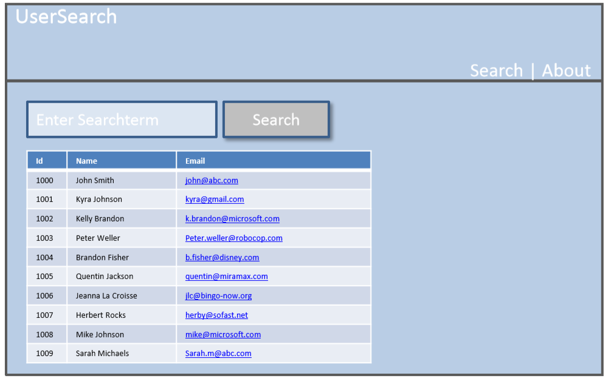

### Continuation TASK

## Task 6 - Add Navigation with React Router

- **0** Install `react-router-dom` in the task project.

- **1** As in the image above, we will create another tab in the Header, one for search and another for about. Create inside the Header component, this two links. Use the `<Link>` component from react router to create this links. **DONT FORGET TO IMPORT LINK FROM `react-router-dom`**

- **2** Create a new stateless component (functional component), call About. This component will return this paragraph 
  - “This little web-app was done by me. Feel free to send me an email to student@digitalcareerinstitute.org“ 
- **3** Import this ***About*** component into the main Container, ***App.js***. Also import the needed Components from `react-router-dom`.
- **4** Then inside the ***App.js***, we should render according to the path we visit. For this we use `<Switch>` from `react-router-dom`. Then add the needed `<Route>` Components, one for the ***About*** Component and other of the ***SearchResult*** Component. Also, all of our jsx code inside the render should be inside the `BrowserRouter`.

- **5** Your application should be working by now. When you click on search should appear the component ***SearchResult*** with the input text and the button. When you click about, the ***About*** Component should appear.

